# Prawdopodobieństwo bankructwa ubezpieczyciela ze względu na skalę działalności oraz formę i wielkość narzutu finansowego
Autor : Konrad Barszczewski

Data : 08.03.2026
## Cel projektu

Celem projektu jest zbadanie wpływu liczby klientów w portfelu ubezpieczeń na życie na ryzyko bankructwa tego portfela.

---

## Założenia

Przedmiotem badania są portfele ubezpieczeń na życie z wypłatą świadczenia na koniec roku śmierci.

Dla uproszczenia modelu przyjęto następujące założenia:

1. Stała techniczna stopa procentowa  $i = 5$%

2. Brak kosztów operacyjnych.

3. Ubezpieczyciel otrzymuje jednorazową płatność w momencie zawarcia umowy, tj. jednorazową składkę netto powiększoną opcjonalnie o narzut.

4. Analizowane portfele obejmują 30-letnich mężczyzn, a wysokość świadczenia wynosi 1000 zł.

5. W trakcie trwania umowy do ubezpieczyciela nie wpływają dodatkowe środki.

6. Wykorzystano tablice trwania życia mężczyzn z roku 2022 publikowane przez GUS.

7. Maksymalny wiek życia przyjęto równy 100 lat, tzn. prawdopodobieństwo, że osoba w wieku 100 lat umrze w kolejnym roku, wynosi 100%.

---

## Wycena świadczenia

Rozważono trzy różne zasady ustalania składki.

### 1. Jednorazowa składka netto

$$
Cena = JSN =
S \sum_{n=1}^{100-k}
\left(\frac{1}{1+i}\right)^n
\left({}_{n}q_k - {}_{n-1}q_k\right)
$$

### 2. Zasada narzutu proporcjonalnego

$$
Cena = JSN(1+\alpha)
$$

### 3. Zasada odchylenia standardowego

$$
Cena = JSN + \alpha \sigma
$$

gdzie:

- $S$ – wysokość świadczenia  
- $i$ – techniczna stopa procentowa  
- $k$ – wiek klienta w momencie zawarcia umowy  
- ${}_{n}q_k$ – prawdopodobieństwo, że osoba w wieku $k$ umrze w ciągu $n$ lat  
- $\alpha$ – współczynnik narzutu finansowego  

Odchylenie standardowe wynosi

$$
\sigma =
\sqrt{
S^2
\sum_{n=1}^{100-k}
\left(\frac{1}{1+i}\right)^{2n}
\left({}_{n}q_k - {}_{n-1}q_k\right)
}
$$

---

## Metodologia symulacji

Dla każdego portfela ustalany jest kapitał początkowy

$$
C_0 = N \cdot Cena
$$

gdzie $N$ oznacza liczbę klientów.

W każdym roku kapitał ubezpieczyciela jest kapitalizowany stopą procentową $i$. Następnie z rozkładu dwumianowego losowana jest liczba zgonów $D_n$ wśród klientów żyjących w poprzednim roku.

Wypłaty świadczeń wynoszą

$$
D_n S
$$

Kapitał w roku $n$ opisuje równanie

$$
C_n = C_{n-1}(1+i) - D_n S
$$

Symulacja jest prowadzona do momentu, gdy:

- kapitał ubezpieczyciela spadnie poniżej zera, lub  
- wszyscy klienci umrą.

Każdy scenariusz symulowany jest **5000 razy**.

Na podstawie przeprowadzonych symulacji oszacowano prawdopodobieństwo bankructwa każdego z analizowanych portfeli oraz zbadano zależność między tym prawdopodobieństwem, liczbą klientów oraz współczynnikiem narzutu $\alpha$.

---

## Wyniki

Rozważmy najpierw sytuację, w której ubezpieczyciel pobiera od klienta jedynie składkę netto.

### Przebieg portfela 10 klientów

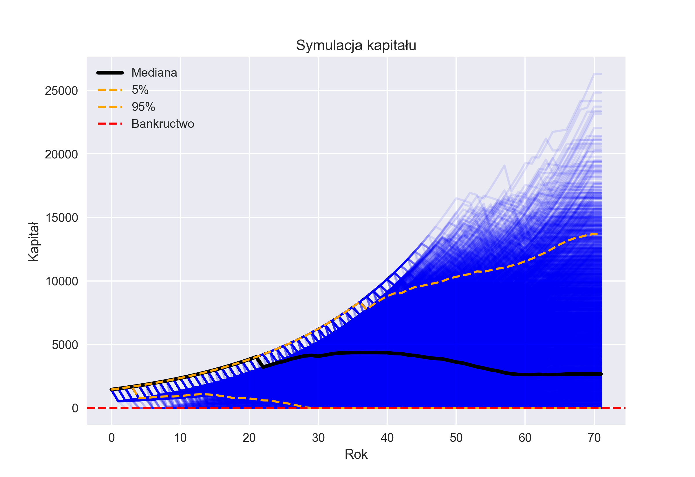

### Przebieg portfela 1000 klientów

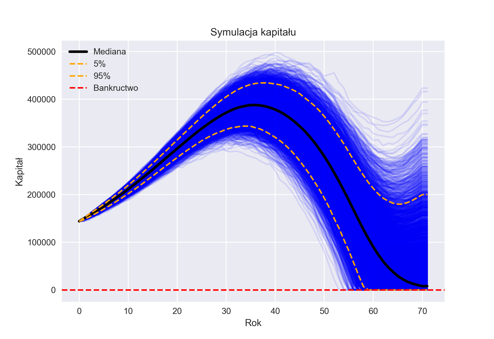

### Przebieg portfela 100000 klientów

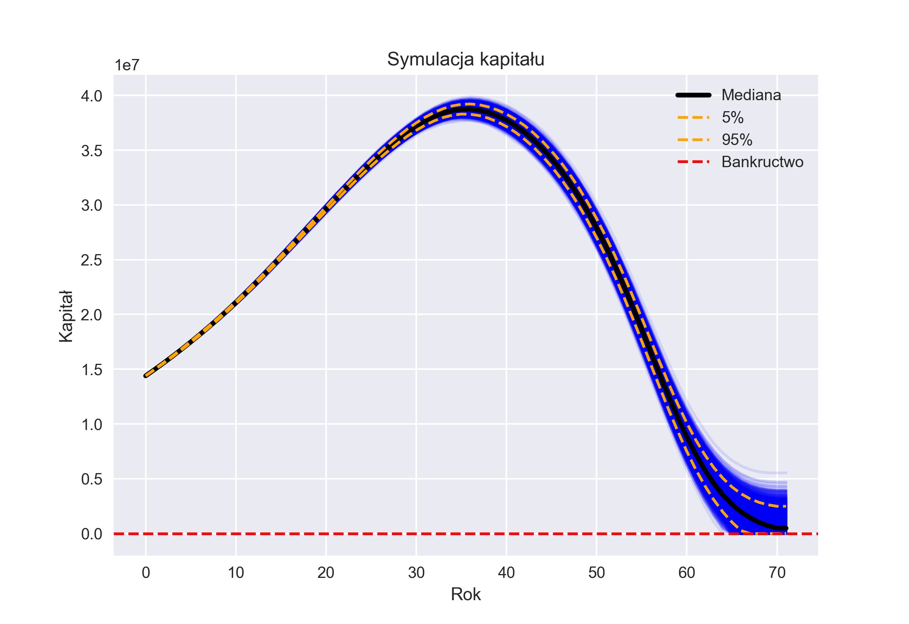

Pierwszą rzeczą, która może zwrócić uwagę, jest niewielka przewaga portfela o małej liczbie klientów, co wydaje się przeczyć intuicji matematycznej.

Aby lepiej zrozumieć to zjawisko, warto przeanalizować rozkład wyników końcowych.

### Wyniki końcowe portfela 10 klientów

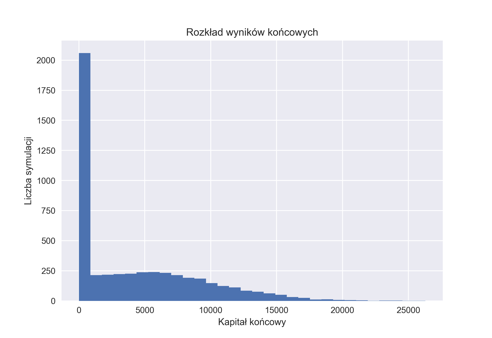

### Wyniki końcowe portfela 1000 klientów

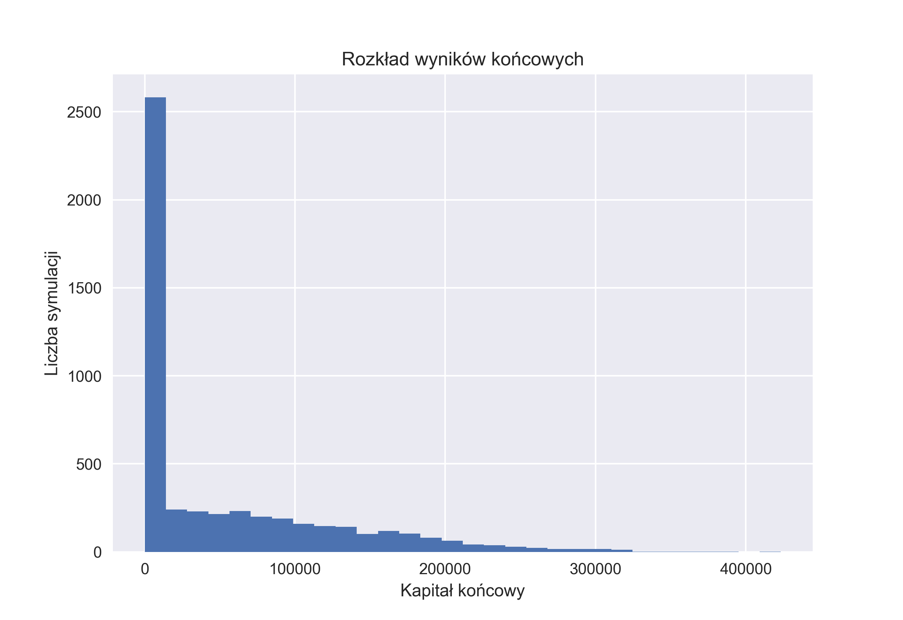

Jak widać, portfel 10 klientów zbankrutował w około **40% symulacji**, natomiast portfel 1000 klientów zbankrutował w nieco ponad **50% przypadków**.

Przyczyną tego zjawiska jest fakt, że przy pobieraniu jedynie jednorazowej składki netto oczekiwana wartość końcowego kapitału ubezpieczyciela wynosi zero. Z definicji składka netto pokrywa jedynie oczekiwaną wartość świadczeń, nie uwzględniając zysku ubezpieczyciela.

W konsekwencji, zgodnie z prawem wielkich liczb, wraz ze wzrostem liczby klientów końcowy kapitał portfela zbiega do zera. Natomiast w przypadku małych portfeli zmienność wyników jest znacznie większa – część realizacji prowadzi do wysokich zysków, a część do szybkiego bankructwa.

---

## Narzut proporcjonalny

Rozważmy teraz wpływ dodania narzutu w wysokości **10% JSN**, czyli zastosowanie zasady narzutu proporcjonalnego ze współczynnikiem $\alpha = 0.1$.

### Przebieg portfela 10 klientów

### Przebieg portfela 1000 klientów

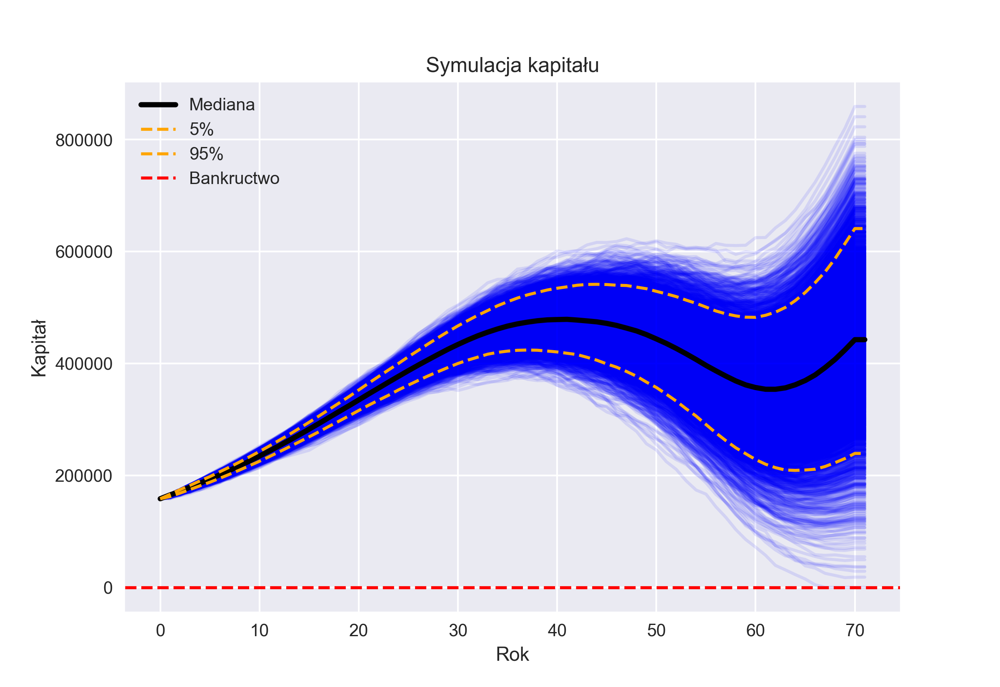

### Przebieg portfela 100000 klientów

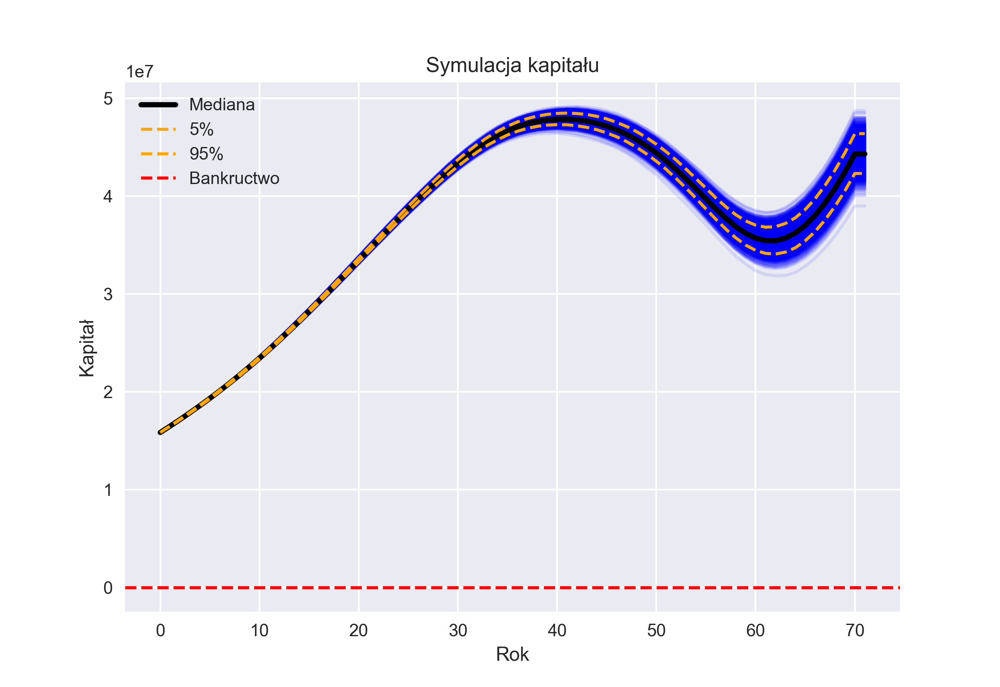

Jak widać, przy dodaniu narzutu portfele radzą sobie tym lepiej, im większą liczbę klientów obejmują.

Portfel 100000 klientów podczas 5000 symulacji nie zbankrutował ani razu.  
Portfel 1000 klientów bankrutował bardzo sporadycznie.  
Natomiast portfel 10 klientów nadal wykazuje stosunkowo wysoki odsetek bankructw.

### Rozkład wyników portfela 10 klientów

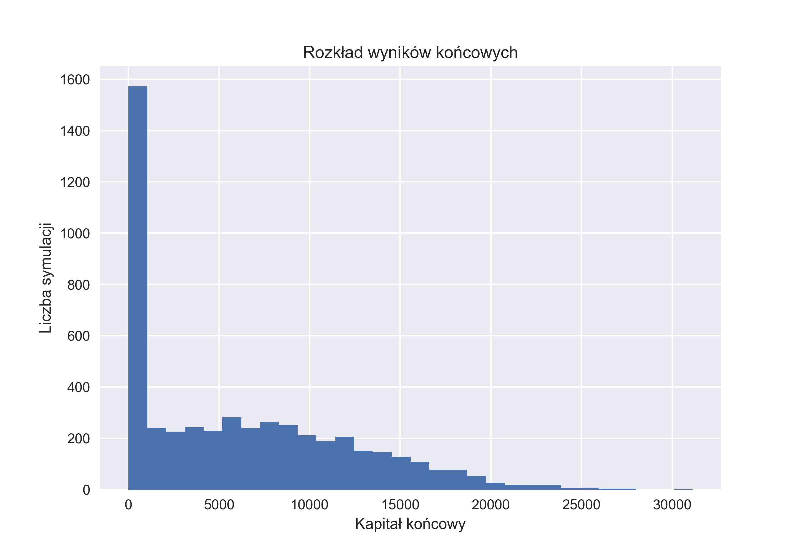

Na 5000 symulacji portfel ten zbankrutował w około **1600 przypadkach**, co daje prawdopodobieństwo bankructwa w okolicach **32%**.

---

## Zasada odchylenia standardowego

Rozważmy jeszcze wyniki uzyskane przy zastosowaniu zasady odchylenia standardowego ze współczynnikiem

$$
\alpha = 0.15
$$

### Przebieg portfela 10 klientów

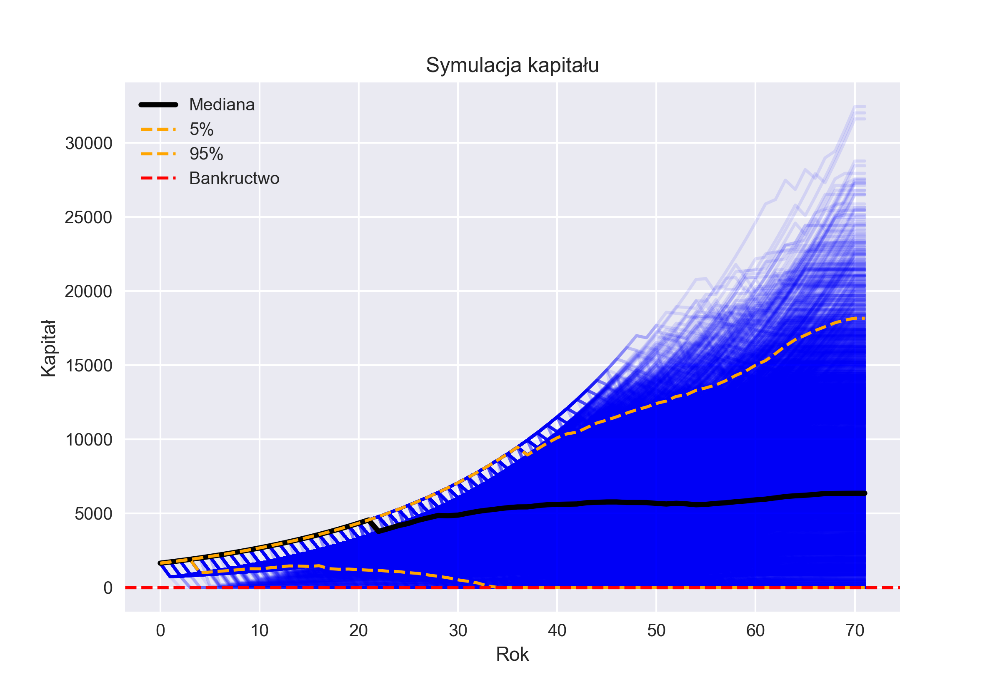

### Przebieg portfela 1000 klientów

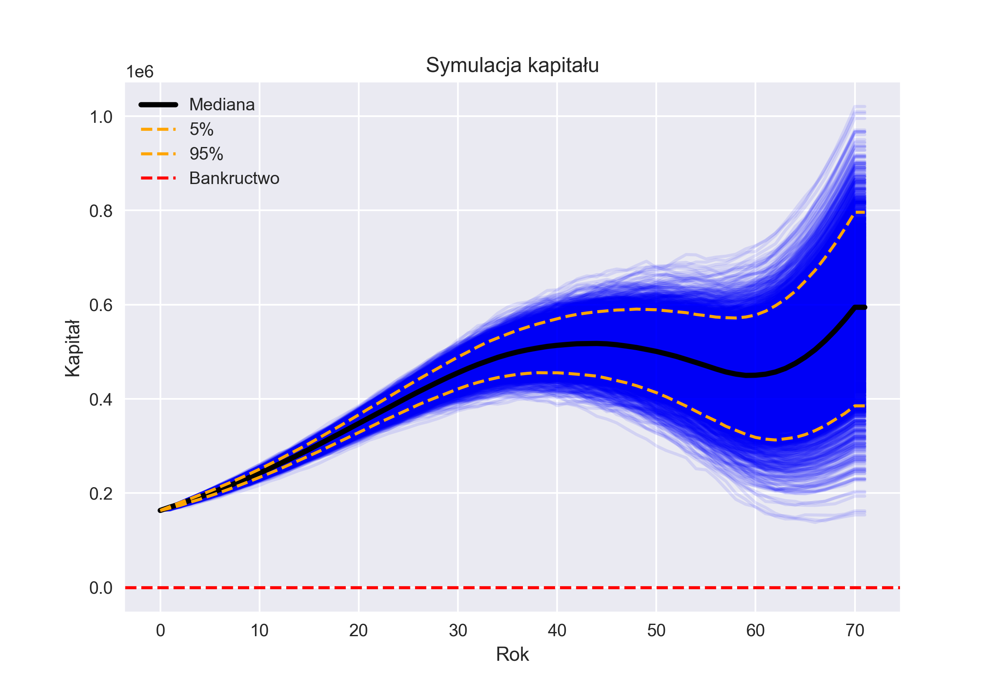

Uzyskane wyniki są w dużej mierze podobne do tych otrzymanych przy zastosowaniu zasady narzutu proporcjonalnego.

---

## Prawdopodobieństwo bankructwa a liczba klientów

### Zasada narzutu proporcjonalnego

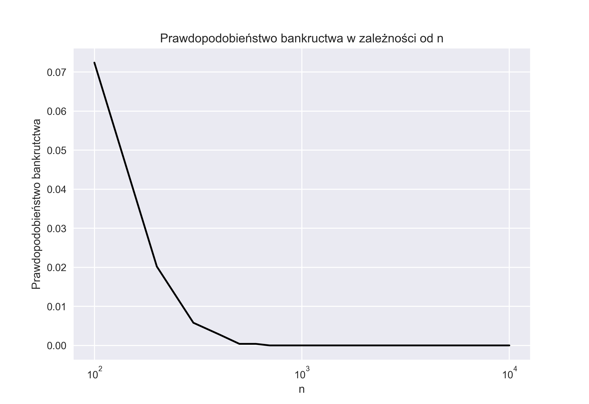

### Zasada odchylenia standardowego

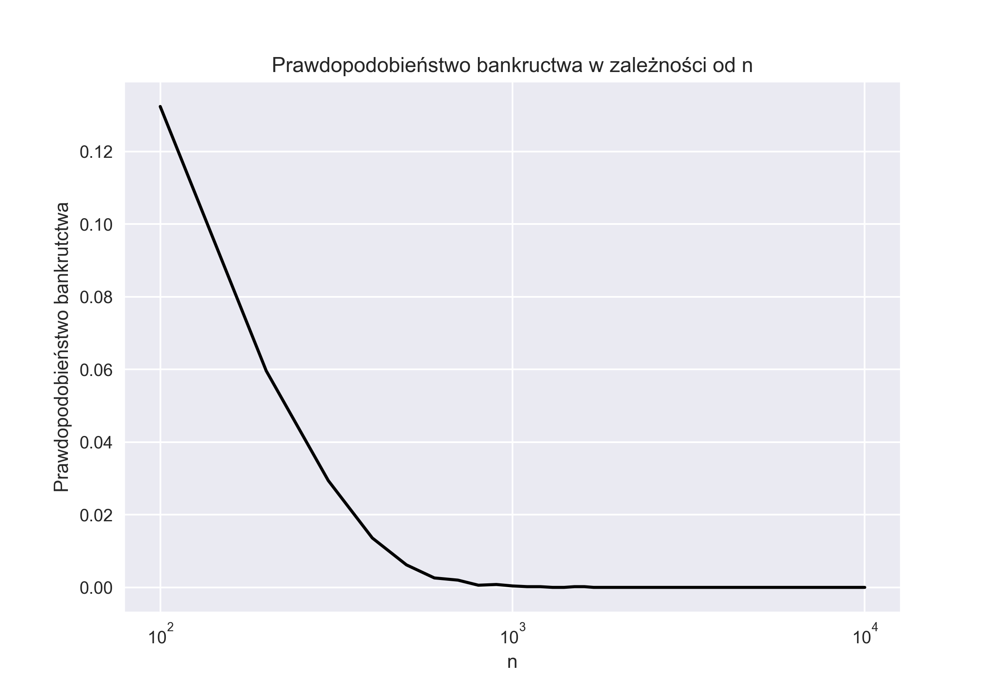

W obu przypadkach obserwujemy, że przy stałym współczynniku narzutu prawdopodobieństwo bankructwa maleje wraz ze wzrostem liczby klientów.

Przy podobnym współczynniku narzutu można zauważyć niewielką przewagę zasady narzutu proporcjonalnego. Wynika to z faktu, że wartość oczekiwana zdyskontowanej wypłaty świadczenia jest większa od jej odchylenia standardowego. W konsekwencji przy tym samym współczynniku $\alpha$ cena wynikająca z narzutu proporcjonalnego jest wyższa, co naturalnie prowadzi do niższego ryzyka bankructwa.

---

## Porównanie portfeli o różnej skali

Na koniec porównajmy portfele liczące **100 i 1000 klientów**.

### Portfel 100 klientów

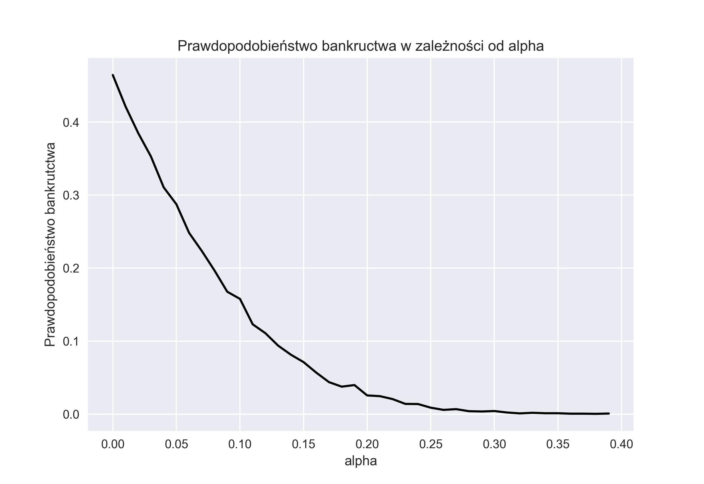

### Portfel 1000 klientów

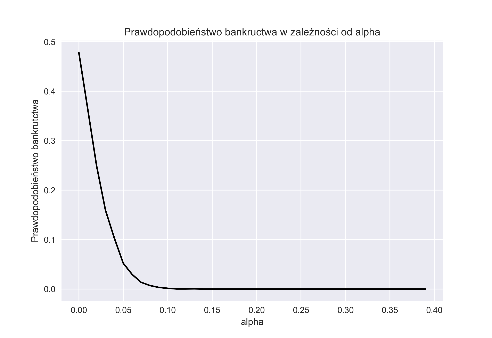

Jak widać, prawdopodobieństwo bankructwa portfela 1000 klientów zbliża się do zera już w okolicach

$$
\alpha = 0.1
$$

Natomiast dla portfela 100 klientów osiągnięcie podobnego poziomu ryzyka wymaga współczynnika około

$$
\alpha = 0.3
$$

---

## Wnioski

Z przeprowadzonej analizy wynika, że:

- portfele obejmujące większą liczbę klientów charakteryzują się niższym ryzykiem bankructwa,
- jedyną sytuacją, w której niewielką przewagę mogą wykazywać portfele małe, jest model bez narzutu finansowego, który ma jednak charakter czysto teoretyczny,
- obie analizowane formy narzutu prowadzą do zadowalających rezultatów, przy czym narzut proporcjonalny przy tym samym współczynniku daje nieco lepsze wyniki,
- nawet różnica jednego rzędu wielkości w liczbie klientów może wymagać znacząco wyższych cen świadczenia, aby utrzymać ten sam poziom ryzyka bankructwa.

Wyniki pokazują również, że skala działalności stanowi istotny element stabilności finansowej zakładów ubezpieczeń, a odpowiedni narzut bezpieczeństwa jest kluczowy dla ograniczenia ryzyka bankructwa.

---

## Bibliografia

1. Błaszczyszyn B., Rolski T.  
   *Podstawy matematyki ubezpieczeń na życie*,  
   Wydawnictwo Naukowe PWN, Warszawa, 2018.

2. Główny Urząd Statystyczny (GUS)  
   *Tablice trwania życia ludności Polski 2022*,  
   Warszawa, 2023.  
   https://stat.gov.pl/en/topics/population/life-expectancy/life-expectancy-tables-of-poland-2022/
